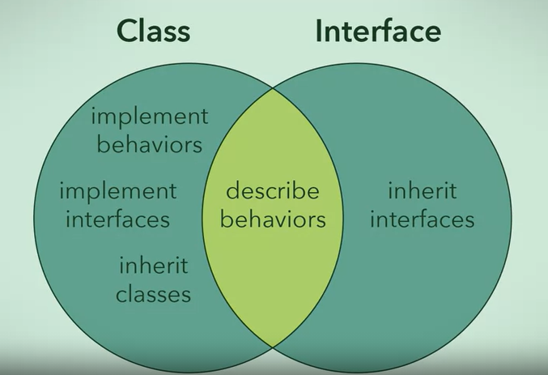

# Week 2: Object-Oriented Modeling

## 1.2.1 Models: Bridging Concepts and Solutions

***Glossaries***

1. Top Down Programming
2. Object-Oriented Analysis
3. Object-Oriented Design
4. Unified Modeling Language (UML)  
5. Object-Oriented Modeling  

## 1.2.2 Languages Evolution

***Glossaries***

1. COBOL *(programming language)*
2. Fortran *(programming language)*
3. Programming Paradigms
4. Global Data
5. Global Data Access
6. Subprograms
7. Algol 68 *(programming language)*
8. Pascal *(programming language)*
9. Local Variables
10. Nested Procedures
11. C *(programming language)*
12. Modula-2 *(programming language)*

***Imperative Paradigm***

> COBOL and Fortran followed an imperative paradigm which broke up large programs into smaller programms called subroutines, which are like methods in Java.

***Abstract Data Type***

> An abstract data type is a data type that is defined by programmer and not built into the language. An abstract data type is essentially a grouping of related information that is denoted with a type. It was a way to organize data in a meaningful way.

The goal of object-oriented design is to:

* Make an abstract data type easier to write
* Structure a system around abstract data types called classes
* Introduce the ability for an abstract data type to extend another

Advantages of object-oriented design

> The system will mimic the structure of the problem

Popular object-oriented languages:

1. Java
2. C++
3. C#

There are many systems that still use the older languages and design paradigms.

## Four Design Principles

---

## 1.2.3 Abstraction

***Abstraction***

> Abstraction is the idea of simplifying a concept in the problem domain to its essntials within some context. Abstraction allows you to better understand a concept by breaking it down into a simplified description that ignores unimportant details.

***Rule of Least Astonishment***

> The abstraction captures the essential attributes and behaviour for a concept with no surprises and no definitions that fall beyond its scope. You don't want to surprise anyone trying to understand your abstraction with irrelevant characteristics.

***Examples of abstraction of a student***

Some of the essential characteristics of a student:

* The courses they are currently taking
* Their grades in each course
* Their student ID number

Courses, grades, and student ID are the ***attributes***.  
The attributes do not disappear over time although the values may change since they are essential characteristics of a student.

In addition to attributes, an abstraction should describe a concept's ***basic behaviour***.
For a ***student***, those behaviours would be:

1. Studying
2. Doing assignments
3. Attending lectures

These are the ***responsibilities***  

Abstractions are formed within a specific context for perspective and have to be carefully decided what is relevant. If the purpose of the system or the problem changes, abstractions can be updated accordingly.  

> Abstractions are not a fixed creation, but are a direct result of the problem for which created them.

***Questions***

1. What object-oriented programming construct should be used to represent a concept in the problem domain?
    * Class *(Classes are the primary way that the problem domain is represented in object-oriented paradigm. Objects are instances of classes)*

2. Give examples of attributes for a "house cat" from the perspective of a cat owner.
    * name, color, favorite nap location, hunger level, microchip number, etc.

3. Give examples of behaviors for a "house cat" from the perspective of a cat owner.
    * napping, grooming, catching mice in the house, eating, using the litter box, etc.
      *Each of these could be implemented as a method in the house cat class*

4. Try creating a dog abstraction for the software space! Remember to identify both attributes and behaviors.
    * **Attributes**: dog's breed, size, hair, ears, color
    * **Behaviours**: sleeping, eating, doing tricks

## 1.2.4 Encapsulation

***Encapsulation***

> Encapsulation forms a self-contained object by bundling the data, and functions it requires to work, exposes an interface whereby other objects can access and use it, and restricts access to certain inside details.

Encapsulation involves 3 ideas:

1. Bundle attribute values, data, behaviour, or functions that manipulate those values together into a self-contained object
2. Expose certain data and functions of an object, which can be accessed from other objects
3. Restrict access to certain data and functions to only within an object

Why encapsulation?

1. Encapsulation helps with data integrity
2. Encapsulation can secure sensitive information
3. Encalsulation helps with software changes

***Questions***

1. Choose the attributes that will be **encapsulated** in each of the above objects
    * **Student** object: *degree program of the student*
    * **Course** object: *list of students taking the course*
    * **Professor** object: *list of courses the professor teaches*

2. What advantages come from encapsulation?
    * Security is increased due to restricted and controlled access to attributes and methods
    * Changing the software is easier because related data and code are located in the same place
    * Reusability is increased because the interface of a class can stay the same even if its internal implementation changes
        *(this is called **refactoring** and it will be easier to do with proper encapsulation)*

***Glossaries***

1. Bundle
2. Data
3. Functions
4. Expose
5. Restrict
6. Methods
7. Interface
8. Restricted
9. Black box thinking
10. Abstraction barrier  

## 1.2.5 Decomposition

***Decomposition***

> Decomposition is taking a whole thing and dividing it up into different parts. Or, on the flip side, taking a bunch of separate parts with different functionalities and combining them together to form a whole. Decomposition allows you to further break down problems into pieces that are easier to understand and solve.

***Questions***

1. What are some objects that you might get by decomposing a car?
    * Wheels, a steering wheel, a windshield, a gas pedal, engine, a fuel pump
        *(the chosen objects to use in software will depend on the **context**)*

2. Which of these car "parts" has a dynamic number?
    * Passengers *(a car can accommodate a **dynamic** number of passengers)*

3. Returning to our example of a car, can you think another example of a part that contains another part?
    * A headlamp contains a bulb
    * The wheel contains a rim and a tyre
    * An engine contains many things, like pistons and spark plugs
    * Instrument panel contains a fuel gauge, an odometer, and a speedometer

4. Consider the lifetime of a car, can you think of one part that has a closely-related lifetime and one part that does not?
    * Closely-related lifetime: car frame, engine *(when the engine goes, so does the car)*
    * No closely-related lifetime: wheels *(can be replaced many times over the course of a car's life)*

***Glossaries***

1. Fixed number
2. Dynamic number
3. Parts containing parts
4. Lifetime
5. Sharing

## 1.2.6 Generalization

***Generalization***

> Generalization is frequently used when designing algorithms, which are meant to be used to perform the same action on different sets of data. We can generalise the actions into its own method, and simply pass it through a different set of data through arguments.

When a ***child class*** inherits from a ***parent class***, the child class will have the attributes and behaviours of the parent class.
Common attributes and behaviours are placed in parent class.

> In standard terminology, a parent class is known as a superclass and a child class is called the subclass

***Question***

1. Inheritance is used to describe the relationship between classes. What are the three ways in which this relationship is advantageous?
    * Subclasses that inherit from the same superclass include attributes and behaviours from the superclass  
        *(This is an easy way to share attributes and behaviour among related classes)*
    * Changes can be made easily and quickly to a large group of subclasses by making changes to the superclass they inherit from  
        *(Changes to the superclass apply to all the subclasses unless the subclasses overrides the superclass)*
    * Code can be reused through inheritance, which means we do not need to re-implement behaviours that already exist  
        *(This is one way that you can apply D.R.Y (Don't Repeat Yourself)*

***Glossaries***

1. Inheritance
2. Repeated
3. Common
4. Shared characteristics
5. Parent class
6. Child class
7. D.R.Y (Don't Repeat Yourself)  

## Expressing Design Structure in Java & UML Class Diagrams

---

## 1.2.7 Abstraction in Java and UML

Example of ***CRC card*** and ***class diagram*** representation of **`food class`**

***Example 1***  
Converting class diagram into Java code

```none
CRC card
.------------------------------------.
| Food                               |   <--- class name
'-----------------------.------------'
| Know grocery ID       |            |
| Know name             |            |
| Know manufacturer     |            |
| Know expiry date      |            |
| Know price            |            |
| Check if on sale      |            |
'------------------------------------'
        ^                      ^
  Responsibility         Collaborator
  

Class diagram
.---------------------------.
| Food                      |   <--- class name
'---------------------------'          the same as class name in Java class
| groceryID: String         |
| name: String              |
| manufacturer: String      |   <--- properties
| expiryDate: Date          |          equivalent to member variables 
| price: double             |          in Java class and define the
'---------------------------'          attributes of the abstraction
| isOnSale(): boolean       |   <--- operations
'---------------------------'          equivalent to the methods in
                                       Java class and define the behaviour
                                       of the abstraction
```

The equivalent Java code

```java
// class name turns into class
public class Food {
    // properties turn into member variables
    public String groceryID;
    public String name;
    public String manufacturer;
    public Date expiryDate;
    public double price;

    // operation turns into method
    public boolean isOnSale
    () {

    }
}
```

***Example 2***  
Converting Java code into class diagram

```java
public class ClickCounter {
    private int count;

    public ClickCounter() {
        count = 0;
    }

    public void click() {
        count++;
    }
    public void setClickCount(int ClickCount) {
        count = clickCount;
    }

    public int getClickCount() {
        return count;
    }
}
```

```none
.--------------------------------------.
| ClickCounter                         |
'--------------------------------------'
| count: int                           |
'--------------------------------------'
| click(): void                        |
| setClickCount(clickCount: int): void |
| getClickCount(): int                 |
'--------------------------------------' 
```

> CRC card does not show clear separation between ***properties*** and ***operations***. See how both are combined in ***responsibility*** section, which may sometimes cause ambiguity. ***Class diagram*** represents code better.

***Glossaries***

1. UML Diagrams
2. UML Class Diagram (Class Diagram)
3. Abstraction
4. CRC

## 1.2.8 Encapsulation in Java and UML

Ideas of encapsulation:

1. Bundle data and functions that manipulate the data, into a self-contained object
2. Expose certain data and functions of that object, which can be accessed from other objects
3. Restrict access to certain data and functions to only within that object

Example of encapsulation of Student class using UML Class diagram.  
***+*** sign indicates that a method or attribute is public.  
***-*** sign indicates that a method or attribute is private.

```none
.--------------------------------------.
| Student                              |
'--------------------------------------'
| -gpa: float                          |
| -degreeProgram: String               |
'--------------------------------------'
| +getGPA(): float                     |
| +setGPA( float ): void               |
| +getDegreeProgram(): String          |
| +setDegreeProgram( String ): void    |
'--------------------------------------' 
```

UML diagram that displays proper encapsulation for a `Driver` class  
(The attributes are hidden, but there are methods exposed to make changes)

```none
.--------------------------------------.
| Driver                               |
'--------------------------------------'
| -licenseID: String                   |
| -car: Car                            |
'--------------------------------------'
| +getLicenseID(): String              |
| +setLicenseID( float ): void         |
| +getCar(): Car                       |
| +setCar( Car ): void                 |
'--------------------------------------' 
```

***Getter Methods***

> Getter methods are methods that retrieve data, and their names typically begin with get and end with the name of the attribute whose value you will be returning.
>
> Getters often retrieve a private piece of data

***Setter Methods***

> Setter methods change data, and their names typically begin with set and end with the name of the variable you wish to set.
>
> Setters are used to set a private attribute in a safe way.

Java code example  

```java
public class Student {
    private float gpa;
    private String degreeProgram;

    public float getGPA() {
        return gpa;
    }

    public void setGPA(float newGPA) {
        gpa = newGPA;
    }

    public String getDegreeProgram() {
        return degreeProgram;
    }

    public void setDegreeProgram( String newDegreeProgram ) {
        degreeProgram = newDegreeProgram;
    }
}
```

## 1.2.9 Decomposition in Java and UML

***Decomposition***

> Taking a **whole** thing and dividing it up into different **parts**. Or, on the flip side, taking a bunch of separate parts with different functionalities and combining them together to form a whole. Decomposition allows you to further break down problems into pieces that are easier to understand and solve.

There are three types of relationships found in decomposition:

* Association
* Aggregation
* Composition

***Association***

> Association is "some" relationship. This means that there is a loose relationship between two objects. These objects may interact with each other for some time. An object can exist without depending on other objects.

Object pairs that best describe an association

* Kitten - Yarn
* Student - Sport
* Food - Wine

UML class diagram of association

```none
.---------------------.                     .---------------------.
|       Person        |    straight line    |       Airline       |
'---------------------'      denotes        '---------------------'
|                     |    association      |                     |
|                     |         |           |                     |
|                     |         |           |                     |
|                     | 0..*    v      0..* |                     |
|                     |---------------------|                     |
'---------------------'                     '---------------------'

0..* means a person object is associated with zero or more airline objects
it also means an airline object is associated with zero or more person objects
```

Example of association in Java (Wine and Food objects)

```java
public class Wine {
    public void pair(Food food) {
        execute.pair(food);
    }
}
```

***Aggregation***

> Aggregation is a "has-a" relationship where a whole has parts that belong to it. There may be sharing of parts among the wholes in this relationship.
>  
> The "has-a" relationship from a whole to the parts is considered weak. What this means is although parts can belong to the wholes, they can also exist independently.

Object pairs that best describe an aggregation

* Course section and students
* Pet stores and pets
* Bookshelf and books

It means a bookshelf can hold a lot of books but can also have none and it is still a bookshelf.

UML class diagram of aggregation

```none
.---------------------.                     .---------------------.
|      Airliner       |                     |     Crew Member     |
'---------------------'                     '---------------------'
|                     |                     |                     |
|                     |                     |                     |
|                     |                     |                     |
|                     | 0..*           0..* |                     |
|                     |⃟--------------------|                     |
'---------------------'                     '---------------------'

⃟ the empty diamond is the symbol for aggregation. It denotes which object
is considered the whole and not the part in the relationship.
```

Example of aggregation in Java (Airliner and CrewMember objects)

```java
public class Airliner {
    private ArrayList<CrewMember> crew;

    public Airliner() {
        crew = new ArrayList<CrewMember>();
    }

    public void add(CrewMember crewMember) {...}
}
```

Example of aggregation in Java (PetStore and Pet objects)

```java
public class PetStore {
    private ArrayList<Pet> pets;

    public PetStore() {
        pets = new ArrayList<Pet>();
    }

    public void add(Pet pet) {...}
}
```

***Composition***

> Composition is an exclusive containment of parts, otherwise known as a **strong** has-a relationship. What this means is that the whole cannot exist without its aprts. If it loses any of its parts the whole ceases to exist. If the whole is destroyed then all of its parts are destroyed too. Usually you can only access the parts through its whole. Contained parts are exclusive to the whole.

Object pairs that best describe a composition

* Human - Brain

UML class diagram of composition

```none
.---------------------.                     .---------------------.
|        House        |                     |         Room        |
'---------------------'                     '---------------------'
|                     |                     |                     |
|                     |                     |                     |
|                     |                     |                     |
|                     |                1..* |                     |
|                     |◆--------------------|                     |
'---------------------'                     '---------------------'

◆ the filled in diamond next to the house object means that the house is the whole in the relationship.
It also means that has-a relationship is strong. The two related objects cannot exist without each other.
The filled diamond denotes the relationship is composition.
If the house is removed, its rooms would cease to exist. Rooms cannot exist without a house.
```

Example of composition in Java (Human and Brain objects)

```java
public class Human {
    private Brain brain;

    public Human() {
        brain = new Brain();
    }
}
```

Example of composition in Java (Employee and Salary objects)

```java
public class Employee {
    private Salary salary;

    public Employee(Salary employeeSalary) {
        this.salary = employeeSalary;
    }
}
```

or  

```java
public class Employee {
    private float salary;

    public Employee(float salary) {
        this.salary = salary;
    }
}
```

## 1.2.10 Generalisation with Inheritance in Java and UML

UML class diagram of inheritance

```none
  △
  |
  |
superclass is at the head of the arrow
subclass is at the tail

Standard way to fraw inheritanve is to have the arrow pointing upward
It means
- Superclasses are always toward the top
- Subclasses are always toward the bottom

.-----------------------. 
|       Superclass      |
'-----------------------'
| Superclass Attributes |
'-----------------------'
|  Superclass Methods   |
'-----------------------'
            △
            |
            |
.-----------------------. 
|        Subclass       |
'-----------------------'
|  Subclass Attributes  |
'-----------------------'
|   Subclass Methods    |
'-----------------------'
```

***Superclasses and Subclasses***

> The superclasses are the generalized classes and the subclasses are the specialized classes

Example of UML diagram (Animal and Dog classes)

```none
.-----------------------. 
|         Animal        |
'-----------------------'
| #numberOfLegs: int    |
| #numberOfTails: int   |
| #name: String         |
'-----------------------'
| +walk()               |
| +run()                |
| +eat()                |
'-----------------------'
            △
            |
            |
.-----------------------. 
|          Dog          |
'-----------------------'
|                       |
'-----------------------'
| +playFetch()          |
'-----------------------'
```

The # (hash) symbol is used to communicate that the animals attributes are protected.

In Java, a protected attribute or method can only be accessed by:

* The encapsulating class itself
* All subclasses
* All classes within the same package

Therefore, the Dog class will inherit all attributes and behaviors of Animal class if both are in the same package.  

Since an animal is a generalization of specific species, we do not want to be able to create an animal object on its own. We use the keyword **`abstract`** to declare that this class cannot be instantiated. Inheritance in Java is declared using the keyword **`extends`**.

```java
public abstract class Animal {
    protected int numberOfLegs;
    protected int numberOfTails;
    protected String name;

    public Animal(String petName, int legs, int tails) {
        this.name = petName;
        this.numberOfLegs = legs;
        this.numberOfTails = tails;
    }

    public void walk() {...}
    public void run() {...}
    public void eat() {...}
}

public class Dog extends Animal {
    public Dog(string name, int legs, int tails) {
        super(name, legs, tails);
    }

    public void playFetch() {...}
}
```

Explicit constructors are used so that we can assign values to attributes during instantiation.  

A subclass' constructor must call its superclass' constructor if the superclass has an explicit constructor. This is because explicit constructors of the superclass must be referenced by the subclass. Otherwise, the superclass attributes would not be appropriately initialized.  

In order to access the superclass' attributes, methods and constructors, the subclass uses the keyword **`super`**.  

Subclasses can override the methods of its superclass, meaning that a subclass can provide its own implementation for an inherited superclass' method.  

Example of subclass' method overrides the superclass' method

```java
public abstract class Animal {
    protected int numberOfLegs;

    public void walk() {
        System.out.println("Animal is walking");
    }
}

public class Dog extends Animal {
    public void walk() {
        System.out.println("I'd rather lay on the couch");
    }
}
```

***Question***

You are a developer in charge of creating different methods of travel in a video game. The team has decided to give the player various options for transportation, which include: riding a horse, driving a car, or flying a plane. You have decided that you will generalize these modes of transportation into an abstract class called Transport.  

Which attributes and behaviors would you include in your general class?  

`[  ]` `public void verticalMovement() { … }`  
`[  ]` `public int fuel;`  
`[✓]`  `public void moveForward() { … }` *(all transports would know how to move forward)*  
`[✓]`  `public int speed;` *(all of these classes should know how fast they are going, even if the speeds are quite different.)*  

Different types of inheritance:  

* Implementation inheritance
* Multiple inheritance

In Java, only a single ***implementation inheritance*** is allowed.  
While a superclass can have multiple subclasses, a subclass can only inherit from one superclass. A subclass can be a superclass to another class.  

```none
                       .-----------------------. 
                       |         Animal        |
                       '-----------------------'
                       | #numberOfLegs: int    |
                       | #numberOfTails: int   |
                       | #name: String         |
                       '-----------------------'
                       | +walk()               |
                       | +run()                |
                       | +eat()                |
                       '-----------------------'
                                   △
                                   |
             ____________________________________________
            |                                            |
.-----------------------.                    .-----------------------.
|          Dog          |                    |          Cat          |
'-----------------------'                    '-----------------------'
|                       |                    |                       | 
'-----------------------'                    '-----------------------' 
| +playFetch()          |                    | +playWithYarn()       |
'-----------------------'                    '-----------------------'
```

Implementation in Java

```java
public class Cat extends Animal {
    public Cat(string name, int legs, int tails) {
        super(name, legs, tails);
    }

    public void playWithYarn() {...}
}

public class Dog extends Animal {
    public Dog(string name, int legs, int tails) {
        super(name, legs, tails);
    }

    public void playFetch() {...}
}
```

## 1.2.11 Generalization with Interfaces in Java and UML

A class denotes a type for its object. The type signifies what these objects can do through public methods. In modeling a problem, we may want to express subtyping relationships between two types. For example, we can have dog type as a ***subtype*** of animal type. This means a dog object is not only dog type, it is also animal type. So a dog object behaves not only like a dog, it should also behave like an animal. In effect, a dog is an animal. In Java, class inheritance with the ***extends*** keyword is often used for subtyping. If a dog subclass extends an animal superclass, a dog object behaves not only like a dog, it will also behave by default like an animal through the inherited methods and attributes of an animal. In effect, a dog is an animal. Here, the dog class inherits the ***implementation details*** of animal class.  

An interface only declares method signatures, and no constructors, attributes, or method bodies. In Java, an ***interface*** is also used for subtyping. An interface is like a contract to be fulfilled by implementing classes. Interfaces are ***not classes***. Interfaces are used to describe behaviors.  

In Java, the keyword `interface` is used to indicate that we are creating an interface. Standard naming convention places the letter `I` before an actual name to indicate an interface.  

Example of interface implementation in Java

```java
public interface IAnimal {
    public void move();
    public void speak();
    public void eat();
}
```

> Never implement or describe how these behaviors are performed, but only show that the class (Animal) has these behaviors.  

We need to declare that we are going to fulfill the contract as described in the interface. The keyword in JAVA for this action is **`implements`**.  

Example

```java
public class Dog implements IAnimal {
    /* Attributes of a dog can go here */

    public void move() {...}
    public void speak() {...}
    public void eat() {...}
}
```

> You must have all the method signatures explicitly declared and implemented in the class.

In this example, we must have `move()`, `speak()`, and `eat()` methods.  

***Question***

What are the three advantages that an interface will give us?  
`[  ]` Different classes will have the exact same implementations of behaviors.  
`[✓]` Interfaces can be implemented by multiple classes. *(Interfaces can be used by many classes just like subclass inheritance)*  
`[✓]` Classes can decide how to perform the behaviors described in an interface. *(Interfaces only specify the required methods, not how to implement them)*  
`[✓]` A class can implement multiple interfaces. *(This is one of the advantages that interfaces have that subclass inheritance does not)*  

Interfaces are explicitly noted in UML class diagrams using ***guillemets***, or French quotes, to surround the word `interface`. The interaction between an interface and a class that is implementing the interface is indicated using a dotted arrow. The class touches the tail end of the arrow and the interface touches the head of the arrow.  

```none
.-----------------------. 
|     «interface»       |
|    Interface name     |
'-----------------------'
|                       |
'-----------------------'
| +behavior()           |
'-----------------------'
           △
           :
           :
.-----------------------. 
|         Class         |
'-----------------------'
|                       |
'-----------------------'
|                       |
'-----------------------'           
```

Example of implementation of `Dog` class and `IAnimal` interface

```none
.-----------------------. 
|     «interface»       |
|       IAnimal         |
'-----------------------'
|                       |
'-----------------------'
| +eat()                |
'-----------------------'
           △
           :
           :
.-----------------------. 
|          Dog          |
'-----------------------'
|                       |
'-----------------------'
| +eat()                |
'-----------------------' 
```

***Abstract Classes***

> Classes that cannot be instantiated.  

Interfaces are a means to implement ***polymorphism***.  

***Polymorphism***

> In object oriented languages, polymorphism is when two classes have the same description of a behavior, but the implementations of the behavior may be different.

***Example:***  
Comparing a cat and a dog. Both can speak but cat meows and dog barks. The description of the behavior is the same, but the actual behavior implementation is different.

Example in Java

```java
public interface IAnimal {
    public void move()
    public void speak();
    public void eat();
}

public class Dog implements IAnimal {
    public void speak() {
        System.out.println("Bark!");
    }
}

public class Cat implements IAnimal {
    public void speak() {
        System.out.println("Meow!");
    }
}
```

Interface rules:

1. Interfaces can inherit from other interfaces.  
2. Interface inheritance should not be abused.  

Example in Java

```java
// first interface
public interface IVehicleMovement {
    public void moveOnX();
    public void moveOnY();
}

// the first interface can be used for vehicles with 2-axis movement.
// In case of airplane or submarine that can move on z-axis, instead of
// creating a new interface, the second interface can inherit from
// the first interface.

// below is the second interface that will inherit from the first interface
public interface IVehicleMovement3D extends IVehicleMovement {
    public void moveOnZ();
}
```

***Question***

Select two of following statements about interfaces of which are true:  
`[  ]` Interfaces are abstract class and are a means through which polymorphism can be achieved.  
`[✓]` Interfaces can extend other interfaces. *(This allows you to compose different interfaces with reusable pieces)*  
`[  ]` Interfaces can extend classes.  
`[✓]` Interfaces are not classes, but like abstract classes, are a means through which polymorphism can be achieved. *(Interfaces have different properties that you can use to their advantage)*  

Inheritance in Java:

1. Java does not support ***multiple inheritance*** because inheriting from two or more superclasses can cause ***data ambiguity***.  
2. A class can implement as many interfaces as we want.
3. A single implementation for multiple interfaces with overlapping contracts is acceptable

Example of multiple interfaces in Java

```java
public interface IPublicSpeaking {
    public void givePresentation();
    public void speak();
}

public interface IPrivateConversation {
    public void lowerVoiceVolume();
    public void speak();
}

public class Person implements IPublicSpeaking, IPrivateConversation {
    public void speak() {
        System.out.println("This is fine");
    }
}
```

***Class vs. Interface***

  
