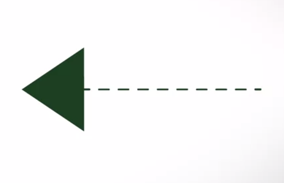

# Week 3: Design Principles

## Design Principles

---

## 1.3.1 Coupling and Cohesion

***Coupling*** focuses on complexity between a module and other modules.
***Cohesion*** focuses on complexity within a module.  

If a module is highly reliant on other modules, it is called ***tightly coupled***.  
If a module is easy to be connected to other modules, it is called ***loosely coupled***. *(preferred)*  

When evaluating the coupling of a module, there are 3 things to consider:

1. Degree
2. Ease
3. Flexibility

***Degree***

> Degree is the number of connections between the module and others. With coupling, you want to keep the degree small. For instance, if the module needed to connect to other modules, through a few parameters or narrow interfaces, then the degree would be small, and coupling would be loose.

***Ease***

> Ease is how obvious are the connections between the module and others. With coupling, you want the connections to be easy to make without needing to understand the implementations of the other modules.

***Flexibility***

> Flexibility is how interchangeable the other modules are for this module. With coupling, you want the other modules easily replaceable for something better in the future.

***Questions***

What aspects of a lego piece makes it looselt couple to other lego pieces?  
`[  ]` Corresponding pieces are hard to find  
`[✓]` It can be connected to any lego piece *(this is the reusability aspect of coupling)*  
`[✓]` Connecting two legos work flawlessly *(this describes the flexibility that you get from loose coupling)*  
`[✓]` Pieces can be interchanged *(This also describes the flexibility you get from loose coupling)*  

What aspects of a puzzle piece make it tightly coupled to other puzzle pieces?  
`[✓]` Corresponding pieces are hard to find *(poor ease)*  
`[  ]` Pieces are interchangeable  
`[✓]` It can only be connected to specific puzzle pieces *(inflexible)*  

***Cohesion***

> Cohesion represents the clarity of the responsibilities of a module.

If a module performs one task and nothing else or has a clear purpose, the module has ***high cohesion***. *(preferred)*  
If a module tries to encapsulate more than one purpose or has an unclear purpose, the module has ***low cohesion***.

***Questions***

What aspects of a lego piece makes it high cohesion?  
`[✓]` A lego's task is clear, "to connect to other lego" *(a cohesive "piece" will have a clear purpose - high cohesion)*  
`[  ]` Corresponding pieces are easy to find  
`[  ]` It can be connected to any other lego piece  
`[  ]` How snug it fits to corresponding pieces  

What aspects of a puzzle piece makes it low cohesion?  
`[  ]` It can only be connected to specific puzzle pieces  
`[  ]` How snug it fits to corresponding pieces  
`[  ]` Corresponding pieces are hard to find  
`[✓]` Its responsibility is unclear and caries in the pieces *(a true statement that addresses low cohesion)*  

Example in Java

```java
public void get (int controlFlag) {
    switch (controlFlag) {
        case 0:
            return this.humidity;
            break;
        case 1:
            return this.temperature;
            break;
        default:
            throw new UnknownControlFlagException();
    }
}
```

***Questions***

Which of the following is true about `Sensor` class and its cohesion?  
`[✓]` `Sensor` class has low cohesion, since it has two purposes and therefore unclear. *(one purpose is enough for one class. Any more than that takes away from cohesion)*  
`[  ]` `Sensor` class has high cohesion, since its purpose is clear.  
`[  ]` `Sensor` class has low cohesion, since its `get` method is not straightforward.  

Which of the following is true about coupling to the Sensor class?  
`[  ]` `Sensor` class has low coupling, since its purpose is clear.  
`[  ]` `Sensor` class has tight coupling, since it has two purposes and therefore unclear.  
`[✓]` `Sensor` class has tight coupling, since its `get` method is not straightforward. *(A user of the `get` method will have to open up `Sensor` to see how it works. That's not loose coupling)*  

***Solution (as UML class diagram)***


***Question***

Suppose you are working on a company that manufactures an automated watering program.  
You are asked to evaluate the complexity of the following code:  

```java
public class Globals {
    public static double Pressure = 0.0;
}

public class LawnSprinkler {
    public void sprinkle() {
        this->_pressure = Global.Pressure;
        this->turnOnWaterPump(this->_pressure);
    }

    private void turnOnWaterPump(double pressure) {
        // implementation
    }

    // .. Other parts of the class
}
```

What can you say about `LawnSprinkler`\'s cohesion?  
`[✓]` It has one clear purpose, to sprinkle the lawn. Therefore it is highly cohesive.  
*(The class is highly cohesive because it is completely focused on sprinkling. `turnOnWaterPump()`*  
*is part of that responsibility, although if it was outsourced to another class, then users of*  
*`sprinkle()` would have no idea!)*  

What can you say about the coupling of `LawnSprinkler`\`s `sprinkle` method?  
`[  ]` It has a small degree due to having no parameter. Therefore it is loosely coupled to its caller.  
`[  ]` It has one clear purpose, to sprinkle the lawn. Therefore it is loosely coupled.  
`[✓]` Despite having no parameter, it lacks ease due to its use of globals. Therefore tightly coupled.  
*(The reason why you should avoid using globals is that you never know what other modules use*
*or modify them. This makes methods that use them have low ease which makes them tightly coupled.)*

## 1.3.2 Separation of Concerns

One goal of software design priciples si to help create a system that is

* flexible
* reusable
* maintainable

***Concern***

> A concern is a very general notion, basically it is anything that matters in providing a solution to a problem.
>  
> How these abstractions are implemented in the software can lead to more concerns. Some of these concerns may involve:  
>
> * What information the implementation represents
> * What it manipulates
> * What gets presented at the end

Example of separation of concerns using UML class diagram  


Example of ***bad design*** in Java (low cohesion)  

```java
public class SmartPhone {
    private byte camera;
    private byte phone;

    public SmartPhone() { ... }

    public void takePhoto() { ... }
    public void savePhoto() { ... }
    public void cameraFlash() { ... }

    public void makePhoneCall() { ... }
    public void encryptOutgoingSound() { ... }
    public void decipherIncomingSound() { ... }
}
```

***Question***

Our `SmartPhone` class can be better designed by applying separation of concerns. Pick the two design changes that we can make in order to build a better `SmartPhone`.  
`[  ]` Remove all of the behaviors for the camera and the phone, and put them into a single new class.  
`[✓]` Remove all the behaviors of the camera and the phone, and put them into separate new classes. *(separate these responsibilities into different classes)*  
`[  ]` Remove the attributes from `SmartPhone` class.  
`[✓]` Change the attributes in the `SmartPhone` class to reference instances of the new classes. *(the `SmartPhone` class can be composed with other objects by having them as attributes)*  

`SmartPhone` class has two concerns:  

1. Act as a traditional phone
2. Be able to use the built-in camera to take pictures  

Improved design presented as UML class diagram

  

Improved design presented in Java code

```java
public interface ICamera {
    public void takePhoto();
    public void savePhoto();
    public void cameraFlash();
}

public interface IPhone {
    public void makePhoneCall();
    public void encryptOutgoingSound();
    public void decipherIncomingSound();
}

public class FirstGenCamera implements ICamera {
    ...
}

public class TraditionalPhone implements IPhone {
    ...
}

public class SmartPhone {
    private ICamera myCamera;
    private IPhone myPhone;

    public SmartPhone(ICamera aCamera, IPhone aPhone) {
        this.myCamera = aCamera;
        this.myPhone = aPhone;
    }

    public void useCamera() {
        return this.myCamera.takePhoto();
    }

    public void usePhone() {
        return this.myPhone,makePhoneCall();
    }
}
```

***Question***

Microsoft in the process of redesigning their SmartPhone in order to increase their market share. As a new hire with years of industry experience, your manager has asked for your opinion of the current design. You noticed that speakers and LED lighting controls are all encapsulated in a single Utility class, and make a suggestions to separate the two into their own classes.  

What are the three reasons that you would give for this design change?  
`[  ]` It is easier to reuse the code because classes are more coupled with each other.  
`[✓]` The increase in modularity helps with creating a flexible system where additional classes and functionality can be added with east or reused in other systems. *(these cohesive objects are easier to reuse than objects that try to do many different things)*  
`[✓]` Cohesion of the system is increased by encapsulating related functions into separate, and distinct classes. *(The new `Lighting` and `Speaker` classes will be more cohesive since they encapsulate one responsibility each.)*  
`[✓]` The system becomes easier to maintain because classes are more specialized and contain less code. *(ach class is easier to maintain because its purpose is clear and you don't have to wade through code to fix one specific aspect.)*  

## 1.3.3 Information Hiding

***Information hiding***

> Information hiding allows modules of our system to give others the minimum amount of information needed to use them correctly and "hide" everything else.

***Question***

You are a software engineer at Amazon who works on the system used to ship products out to customers. It is important to the company that they restrict sensitive customer information on a need-to-know basis.  

Identify which parts of the customer’s information you would need to do your work on the shipping system, and which parts should be hidden because you do not need it.  
`[✓]` Phone number *(Usually a phone number is included with shipping, so that the shipping company can contact the customer if there are problems!)*  
`[  ]` Email  
`[✓]` Full name *(This is relevant information to the shipping company since it is needed to find a person, especially if there are problems with delivery)*  
`[  ]` Payment method  
`[✓]` Address *(The shipping system is going to need the address of where the package will be sent)*  

***Information hiding through encapsulation***

> We use encapsulation to bundle attributes and hehaviors into their appropriate class, and expose an interface to provide access.

***Access modifiers***

> Access modifiers change which classes are able to access attributes abehaviors. They also determine which attributes and behaviors a superclass will share with its subclasses.

There are four different levels of access in Java:

* Public
* Protected
* Default
* Private

***Public methods***

> Public methods are also accessible by any class in your system, but this access does not allow other classes to change the implementation of the behavior for the method. A publicly accessible method simply allows other classes to call the method and receive any output from it.

***Example of `public`***  

Notice that we can invoke the behavior but we cannot change how it is implemented because it is hidden from us through encapsulation.  

```java
public class Person {
    public String name;

    public void sleep(int n) {
        wait(n);
    }
}

public static void main(String[] args) {
    Person johnDoe = new Person();
    johnDoe.name = "John Doe";
    johnDoe.sleep(6000);
}
```

***Protected behaviors***

> Protected behaviors and attributes are not accessible to every class in the system. They are only available to the encapsulationg class itself, all subclasses, and classes within the same package.  

***Package***

> Packages are the means by which Java organizes related classes into a single namespace.  

***Example of `protected`***

```java
package Populace;
public class Person {
    protected String name;
    public Person(String newName) {
        this.name = newName;
    }
    public String getName() {
        return this.name;
    }
}

package EducationalInstitution;
import Populace.*;
public class University {
    private String name = "Coursera";
    private List<Person> students = new ArrayList<Person>();

    public static void main(String[] args) {
        University uni = new University();
        Person student = new Person("John Doe");
        student.name = "John Kennedy"; // this line of code will not work because 'name' is protected and in a different package
        uni.students.add(student);
    }
}
```

***Default access modifier***  

> The default access modifier will only allow access to attributes and methods to subclasses or classes that are part of the same package or encapsulation. This access modifier is also called the **no modifier** access because you do not need to explicitly declare it.

***Example of `default`***  

See there is no access modifier declared in from of `String name`

```java
public class Person {
    String name;
}
```

***Private access modifier***

> Private attributes and methods are not accessible by any class other than by the encapsulating class itself. This means these attributes cannot be accessed directly and these methods cannot be invoked by any other classes.

## 1.3.4 Conceptual Integrity

Conceptual integrity is about creating consistent software.  
There are multiple ways to achieve conceptual integrity:

1. Communication  
   Adopting certain agile development practices like
   * daily stand-up meetings
   * sprint retrospectives  
   Team members can agree to use certain libraries or methods when addressing certain issues, can help to maintain the consistency of the code, such as naming convention, etc.
2. Code reviews
   Systematic examinations of written code, used to find mistakes and uncover issues in the software, but also to keep idfferent developers consistent with each other.
3. Using certain design principles and programming constructs
4. Having a well-defined design or architecture

***Questions***

You are part of a software team and practicing conceptual integrity. You are creating three different functions : one that calculates a student’s GPA, another that returns the courses a student is taking and lastly, one that returns the degree of a student.  
`[  ]` `GPA()`, `student()`, `getdegree()`  
`[✓]` `calculateStudentGPA()`, `getStudentCourses()`, `getStudentDegree()` *(This answer has consistent formatting and terminology. All of these methods are perfectly clear just from their name)*  
`[  ]` `calculate_gpa()`, `GetCourses()`, `degree()`  
`[  ]` `calculate_student_gpa()`, `getCourses()`, `getDegree()`  

How can code reviews help ensure conceptual integrity?  
`[  ]` Code reviews stresses programmers out to make them work harder and write better code.  
`[✓]` Code reviews help find bugs in code. *(Fixing bugs gives your system more conceptual integrity)*  
`[✓]` Code reviews allows programmers to review each other’s code and let them revise code to make it more consistent with each other. *(Code reviews help find bugs in code and also help programmers keep their code consistent with each other)*  
`[  ]` Code reviews do not help ensure conceptual integrity.  

***Conceptual integrity***

> "It is better to have a system omit certain anomalous features and improvements, but to reflect one set of design ideas, than to have one that contains many good but independent and uncoordinated ideas." - Fred Brooks, *The Mythical Man-Month*

## Generalization Principles

---

## 1.3.5 Inheritance Issues

Misusing inheritance can lead to poor code.  

There are a few points to be aware of when implying inheritance

Ask yourself: *"Am I using inheritance to simply share attributes or behavior without further adding anything special in my subclasses?"* *If yes, they you are misusing inheritance*

Example of misuse of inheritance

```java
public class Pizza {
    private List toppings;
    private String size;
    private String crustStyle;

    public Pizza(String size, String crust) {
        this.toppings = new ArrayList();
        this.size = size;
        this.crustStyle = crust;
    }

    public void addTopping(String topping) {
        this.toppings.add(topping);
    }

    public void bulkAddTopping(ArrayList toppingList) {
        this.toppings.addAll(toppingList);
    }

    public void cook() throws InterruptedException {
        wait(10 * 6000);
    }
}

public class Pepperoni extends Pizza {
    public Pepperoni(string size, String crust) {
        super(size, crust);
        super.addTopping("pepperoni");
    }
}
```

***Explanation***

Despite the fact that a pepperoni pizza is a more specific kind of pizza, it is not really different from a `superclass`. You can see that the `Pepperoni` constructor uses the `Pizza`'s constructor and adds toppings using the `Pizza`'s method. There's no reason to use inheritance in this case, because you can simply use only the pizza class to build the pizza with pepperoni as a topping.  

***Question***

Given the following superclass-subclass pairings, which one is a proper use of inheritance?  
`[  ]` Superclass: `Sandwich`. Subclass: `Ham`; `Tuna Salad`; `Chicken Salad`  
`[✓]` Superclass: `Animal`. Subclass: `Dog`, `Cat`, `Whale` *(There is probably some behaviour that is common to all of these, and some behaviour that is very different between them)*  
`[✓]` Superclass: `Employee` Subclass: `Manager`, `Salesperson`, `Cashier` *(Employee is a generalized type for manager, salesperson, and cashier, but each of these types of employee perform specific functions. )*  
`[  ]` Superclass: `Dog` Subclass: `Husky`, `Golden Retriever`, `Poodle`  

Second indication of improper use of generalization is, if you break the **Liskov Substitution Principle**

***Liskov Substitution Principle***

> This principle states that a subclass can replace a subclass, if and only if, the subclass does not change the functionality of the superclass.

Example of ***breaking*** Liskov Substitution Principle

```java
public class Animal {
    private int numberOfLegs;
    private boolean hasTail;
    /* Other characteristics of an animal can be included here */

    public Animal(int legs, boolean tail) {
        this.numberOfLegs = legs;
        this.hasTail = tail;
    }

    public void walk() { ... }
    public void run() { ... }
    public void eat() { ... }
    /* Other behaviors of an animal can be included here */
}

public class Whale extends Animal {
    public Whale() {
        super(0, true);
    }

    private void swim() { ... }

    public void run() {
        this.swim();
    }

    public void walk() {
        this.swim();
    }
}
```

***Explanation***

A whale doesn't know how to run and walk. Running and walking are behaviors of land animals. The Liskov Substitution Principle is violated here, because the whale class overrides the animals classes running and walking functions and replaces them with swimming behaviors. The whale no longer behaves in the way we would expect its superclass to behave.  

***Question***

We’ve seen ways in which inheritance can be misused, but in what case is it correct to generalize classes and use inheritance?  

Select the two conditions in which you would be able to properly use the generalization principle for inheritance.  
`[✓]` The subclass has more functionality than the superclass. *(This is one condition for using a subclass. If there were no specialized behaviour, you could just use the superclass directly)*  
`[✓]` Subclasses provide and share attributes and behaviors from the same superclass, but each subclass has their own distinct functions. *(This is the ideal use of inheritance.)*  
`[  ]` A subclass can replace all of a parent class’ behaviors with totally different responsibilities  
`[  ]` Any class should not know too much about the system.  

***Example of unsuitable inheritance***


***Best practice using decomposition***

  

If inheritance does not suit your need, consider whether decomposition is more appropriate. A smartphone is a good example of where decomposition works better than inheritance. It does not make sense for us to inherit from the phone and then add camera methods to the subclass smartphone. We should be using decomposition to extract out the camera responsibilities, and put them in their own class. The smartphone now indirectly provides the responsibilities of the camera in the phone. To separate part classes, the smartphone doesn't need to know how these classes work.  

## Modelling Behaviour

---

## 1.3.6 UML Sequence Diagram

Example of sequence diagram of fast food restaurant  


***Sequence diagram***

> A sequence diagram describes how objects in your system interact to complete a specific task.

How to create a sequence diagram:  

1. Use a box to represent role play by an object. The role is typically labeled by the name of the class for the object.

2. Use vertical dotted lines, known as lifelines, to represent an object as time passes by.

3. Use arrows to show messages that are sent from one object to another.  Sending message is drawn as solid line arrow from the sender to the receiver. Returning data is drawn as a dotted line arrow.



***Notes***

> * A sequence diagram can contain other sequence diagrams within it.
> 
> * Draw sequence diagram from left to right
> * When an object is activated, denote this on sequence diagram using small rectangles on the objects lifeline

Example of sequence diagram: changing a channel on television using remote control


Objects that are important in this example:

1. TV viewer
2. Remote
3. Televison

If looping occurs, for example, if the viewer keeps changing channel until it shows the desired channel, the diagram will look like this.  


## 1.3.7 UML State Diagram

## Model Checking

---
## 1.3.8 Model Checking